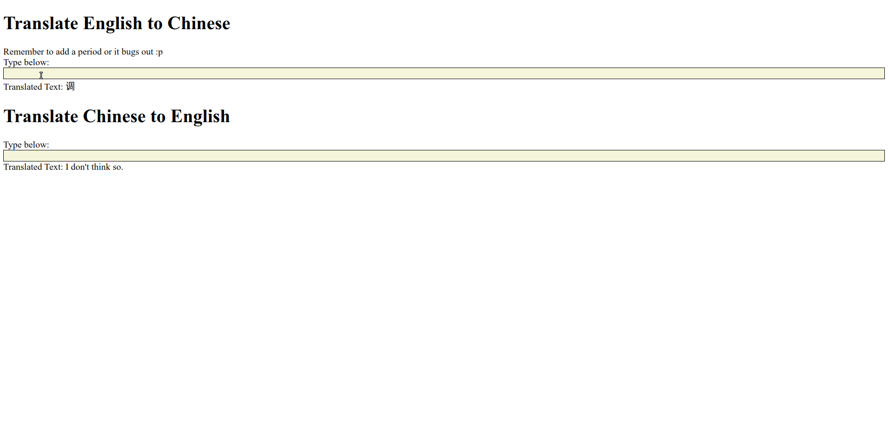

# Chinese-English Translation Web App

Full-stack web application to automatically translate Chinese to English (and vice-versa) with React/FastAPI and deep learning models (BERT) and automated cloud API load-testing with AWS, Terraform, and Locust.



**Currently, this repository is being split up into microservices for the upcoming K8s (EKS/GKE) integration.**

## Table of Contents

- [Frontend](./frontend)
- [Python](./server)
  - [Backend REST API](./server/README.md)
  - [Model Development](./server/chinese_translation_api/models/README.md)
  - [Model Evaluation Pipeline](./server/chinese_translation_api/evaluation)
  - [Load-Testing CLI](./server/loadtest_cli/README.md)
- [AWS/Terraform Deployment Configurations and Scripts](./deploy/README.md)
- [Misc. Documentation](./docs)
  - [Full Stack Cloud Deployment with Docker/NGINX/SSL](./docs/deployment.md)
  - [Research Report](./docs/final_report.md)
  - [Initial Project Proposal](./docs/proposal.md)

## Getting Started

**Make sure you have the following already installed:**

- Frontend
  - `^yarn 1.22.17`
- Backend
  - `^poetry 1.1.11`
- Deployment
  - `docker`
  - `terraform`

Rest will be installed as long as you follow the documentation.

**To build the full web-app and run it:**

```bash
# for building repeatedly when debugging
docker-compose build --no-cache

# running
docker-compose up -d
```

If you don't want to use `docker` or want to debug, run the `frontend` and `server` separately. See the individual READMEs in `frontend` and `server` for more information.

## Tech Stack

- Frontend
  - React, draft.js
- Backend
  - Python, FastAPI
- Model Development
  - PyTorch, HuggingFace
- Deployment and Load-Testing
  - AWS, Docker, Terraform
  - Locust

## Contributors

- [Joseph Chen (jchen42703)](https://github.com/jchen42703/)
- [Benson Jin (Jinb2)](https://github.com/Jinb2)
