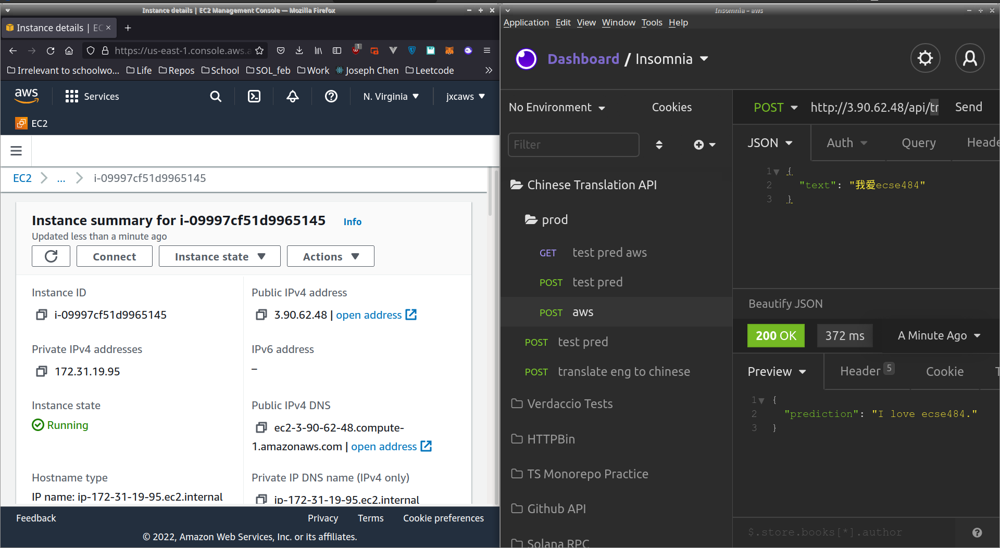
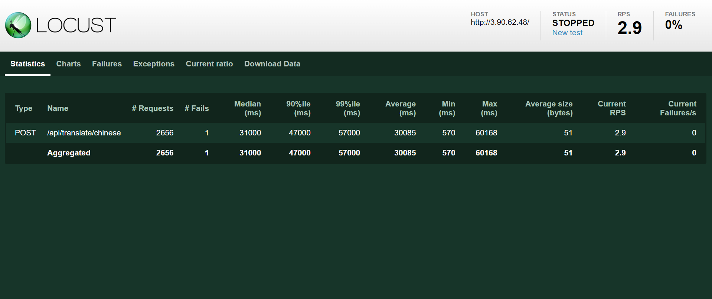
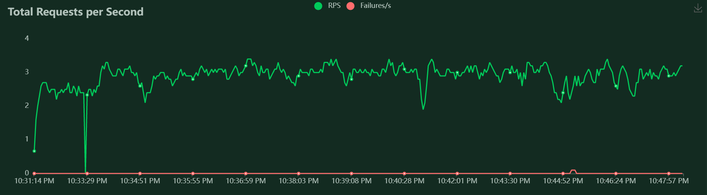
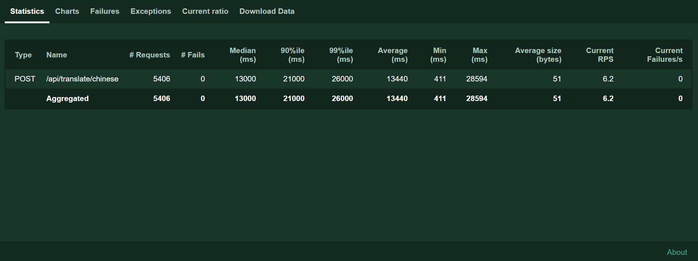
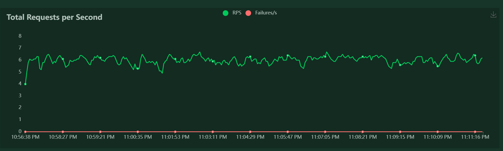
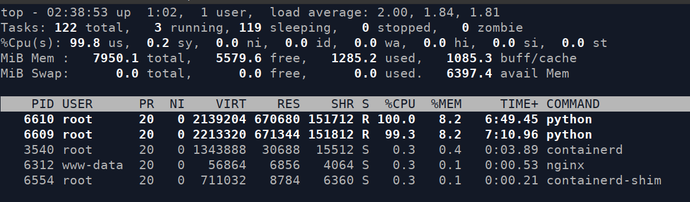

# ECSE 484: Optimizing Chinese Translation Deep Learning Models in Production

Joseph Chen (jxc1598@case.edu)

Benson Jin (bxj155@case.edu)

https://github.com/jchen42703/chinese-translation-api

# Introduction

Neural networks are computationally expensive to run. Not everyone can afford to rent expensive AWS GPU or Google Cloud TPU instances to run their freshly trained models in production to promise low latency. This especially holds true when you're trying to use your model to serve millions of users.

CPU instances are much, much cheaper to host and consequently, are more scalable.

The goal of this project is to test the effect of different techniques on model inference speed and performance on AWS CPU instances and calculate the most cost efficient approach.

# Experimental Design

Our base model for chinese to english translation was `BERT`, which is a widely used model in production for natural language processing applications.

We decided to test if dynamic quantization would make BERT "perform better" in production. We quantified that "performance" in terms of:

- inference speed
- BLEU (how well the models translate the chinese text)
  - We chose BLEU over "better" metrics, such as SacreBLEU, because BLEU one of the most widely used metrics and it was used by the original pretrained BERT.
- speed in production

The dynamic quantization was done through pure PyTorch. Originally, we also planned on experimenting with operation fusion quantization, but due to time constraints, we could not get a working version out.

## Evaluation Process

Inference speed and BLEU were fairly easy to calculate. Since we were using a pretrained BERT for chinese to english translation (https://huggingface.co/Helsinki-NLP/opus-mt-zh-en), we wanted to avoid data leakage. Hence, we used the same test set that the pretrained model used (https://github.com/jchen42703/chinese-translation-api/tree/main/server/test_data). We predicted all of the example chinese strings and compared them to their labeled reference to calculate the BLEU (both sentence-wise BLEU and corpus-wise BLEU). We also benchmarked the inference speeds to give us a sneak peek to production performance.

To test the performance in production, we built an API with FastAPI and PyTorch. We built a CLI to automatically deploy the api to an AWS EC2 instance as a Docker container. The docker container was then served to the public behind an nginx reverse proxy (http only for simplicity) We then load tested the api with Locust.

We also employed specific performance boosting techniques such as:

- Increasing the number of worker connections in nginx to allow for increased traffic
- Running `uvicorn` with 2 workers instead of 1
- Setting the number of Pytorch threads to 1 (This has been shown to be better to prevent conflicts with `uvicorn` by the Roblox engineering team).

We tested with a `t2.large` AWS EC2 instance.

# Results: Evaluation (BLEU)

## Sentence BLEU

At first, we decided to evaluate the BLEU of each sentence and predicted translation of said sentence by each model and then average the BLEUs.

The following evaluation pipelines were run locally on the same machine with 4 workers and 10,000 test samples.

**For the base pretrained BERT:**

**For the quantized BERT:**

The average sentence BLEU of the quantized model was only slightly less (0.221), but the model evaluation was almost 15 minutes faster! That's approximately a 32% increase speed for only a 3% decrease in performance. This was a very good sign that the quantized model would be better suited for production purposes.

## Corpus BLEU

You can immediately tell that the BLEU is quite low (< 0.3). The official BLEU for our pretrained model is 0.356 (https://github.com/Helsinki-NLP/Tatoeba-Challenge/tree/master/models/zho-eng). Hence, we felt that our evaluation strategy was incorrect. Upon further research, we decided to try a corpus wide BLEU evaluation. That means we accumulate all of the references and predictions and evaluate the BLEU all at once. This approach is actually the recommended way for calculating BLEU (since it was designed to be a corpus-wide evaluation metric).

(Ignore the intermediate BLEU scores, those were only corpus BLEUs calculated for sanity purposes)

**For the base pretrained BERT:**

**For the quantized BERT:**

Again, you can see that the quantized model only marginally worse (~3% worse) than the base model, but was much quicker (more than 25% faster than the regular BERT).

A more detailed report of our evaluation blunders and eventually fixes are documented here: https://github.com/jchen42703/chinese-translation-api/blob/main/server/chinese_translation_api/scripts/EVALUATION_REG.md.

# Results: Load Testing an API in Production

We deployed our FastAPI api to AWS EC2 instances through CLI and Docker. Requests were served through an nginx reverse proxy. The specific aws and deploy scripts are located in the `/server/aws` directory and nginx configurations are located in the `/server/nginx` directory.

The API serves POST requests like:

We load tested two versions of the API separately (one with the base BERT and one with the quantized model) with Locust.

Our locust configuration is located in the `server/loadtest` directory. For the experiments below, we mimiced the traffic of 100 users over the course of 15 minutes. The statistics and metrics from the Locust dashboards are shown below.

## No Quantization

## With Quantization

## Observations

The base `BERT` only served `2656 requests /(15 minutes * 60 seconds) = 2.95` requests per second on average, while the quantized model served `5406 requests /(15 minutes * 60 seconds) = 6` requests per second on average. This was a more than 100% increase in performance by using the quantized model. This makes sense since the quantized model is much smaller than the base model (200mb vs 297 mb and 33 million parameters vs 119 million parameters).

## Conclusions and Further Research

Although our experimental results were successful, the overall performance of our API was subpar. With only one user, the latency of the API was 500ms. With over 100 users, the latency was around 30 seconds for the base model and 13 seconds for the quantized model. In production, this is really slow (even without any caching).

We suspect that a reason for this lack of performance is due to us using a fairly low spec'd server (t3.large only has 8 GB of RAM with 2 cores). You can even tell by the screenshot above that both workers are blasting the CPUs at 100%, but the actual total memory consumed is only 16%. We could look towards load testing on a heavier server that has more cores to leverage the extra RAM.

Nevertheless, we were still able to build a quantized model that was able to perform quicker than the base model for a relatively negligible loss in performance. This performance held up both in evaluation scripts and in production.

P.S. Feel free to play around with our models @ https://chinesetranslationapi.com/.

- It's a much smaller server because we're broke college students, but it works.
