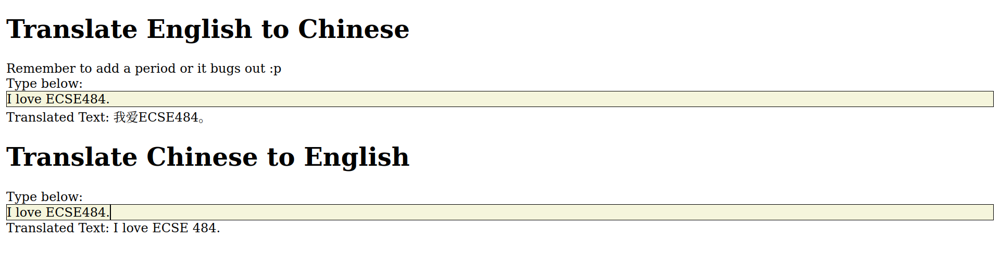

# ECSE 484 HW 10: Project Proposal

Joseph Chen (jxc1598@case.edu)

Benson Jin (bxj155@case.edu)

## Problem Statement

Neural networks are computationally expensive to run. Not everyone can afford to rent expensive AWS GPU or Google Cloud TPU instances to run their freshly trained models in production to promise low latency. This especially holds true when you're trying to use your model to serve millions of users.

CPU instances are much, much cheaper to host and consequently, are more scalable.

The goal of this project is to test the effect of different techniques on model inference speed and performance on AWS CPU instances and calculate the most cost efficient approach.

## Experimental Design & Procedure

`BERT` is widely used in production because it's an all-around good model for natural language processing applications.

The techniques we wanted to explore are:

1. Quantization
   1. Quantized models will do calculations with less bits so model inference will be quicker in exchange for sacrificing performance.
2. Operation fusion
   1. Operation fused models speed up calculations by reducing the number of redundant operations (https://www.tensorflow.org/lite/convert/operation_fusion).

## Approach to Testing Inference Speed

We created an API that takes chinese characters as input and outputs the english translation as a response. We will deploy this API everytime we test the inference speed of model, and subsequently use Locust to load test the API to see how many requests it can manage per second over the course of an hour.

The result will be that for each AWS instance type we test, we will deploy 3 instances:

1. Base model (Our control)
2. Quantized model
3. Operation fusion optimized model

Each instance will be load tested using example chinese phrases/sentences from the OPUS dataset (https://github.com/Helsinki-NLP/Tatoeba-Challenge/blob/master/models/zho-eng/README.md) for an hour, and the number of requests served per hour will be recorded.

## Approach to Testing Model Performance

For the aforementioned 3 models, we will also separately run inference on the same test set and calculate the BLEU (bilingual evaluation understudy). We also plan on using the huggingface `datasets` library for calculating this metric. We will use the performances to weigh the costs/benefits of choosing a quantized/operation fused model vs the original.

## Current Progress

Currently, we have a basic demo deployed on Digital Ocean with a corresponding UI: https://chinesetranslationapi.com/. The source code is here: https://github.com/jchen42703/chinese-translation-api.

**Models:**

- The only model that has been actually deployed is a single pretrained BERT model (from: https://huggingface.co/Helsinki-NLP/opus-mt-zh-en) and is written using PyTorch (permission given by Professor Newman).

**Notes on API Deployment:**

- We used `FastAPI` and `uvicorn` to deploy the API due to their speed and ability to scale easily.
  - For instance, we can run a uvicorn server with multiple workers, which will drastically lower latency when deployed on 8 core machines.
- The demo that we provided utilizes both the chinese to english and english to chinese translation models. However, when we actually deploy and test on AWS instances, we will only use the **chinese to english** model. Both models were included in the demo to make it a better demo :).
- **Disclaimer:** The UI bugs out sometimes, so just refresh the page and that should fix most issues. It is also slow because I deployed the website on a cheap $20 instance with only 2 CPUs.

**AWS Deployment?**

- We have a script that automatically deploys a built docker container of our API to an AWS EC2 instance of choice.

## What's Next?

To actually create the quantized and operation-fused models, we plan on using the Optimum library (https://github.com/huggingface/optimum), which provides ready-to-go interfaces for creating those models.

We also still need to write the evaluation pipelines, such as:

- the automated load testing script
- the BLEU score evaluation pipelines for each model.

Overall, we've made significant progress, and believe that our idea is feasible to finish by the 25th.
