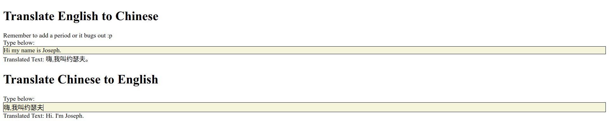

# Frontend

Contains text editors (`draft.js`) to allow users to type in words and get translations back. **API requests are debounced** to prevent huge surges of requests.



## Getting Started

To install dependencies:

```bash
yarn install
```

To run the frontend for development:

```bash
yarn start
```

If you are testing functionality, make sure you are concurrently running the backend with the `DEPLOY_TYPE` equal to anything **besides** `server`.

## Build and Run With Docker

To build:

```
docker build -t chinese_translation_ui .
```

To run:

```
docker run -d --name translation_container -p 3006:3006 chinese_translation_ui
```
