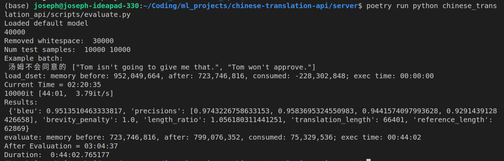
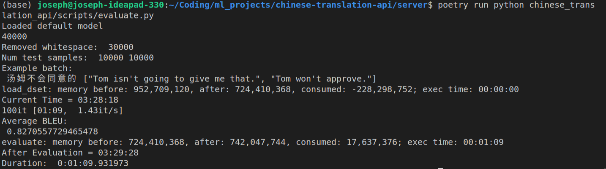
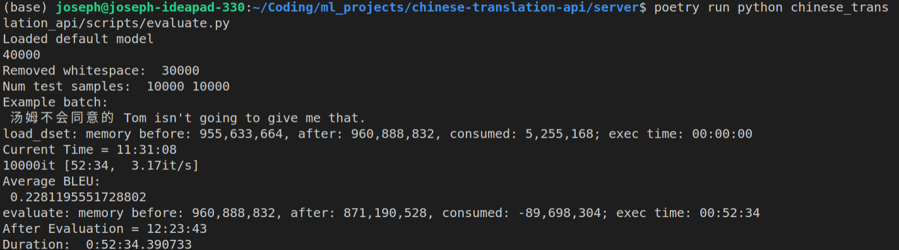
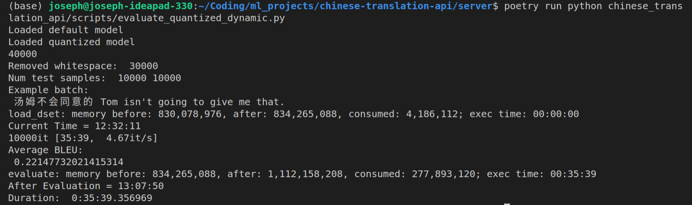
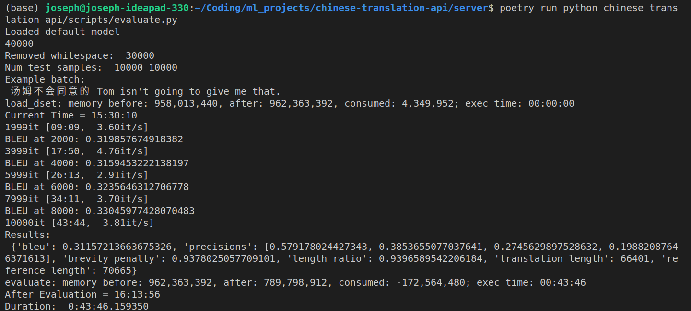
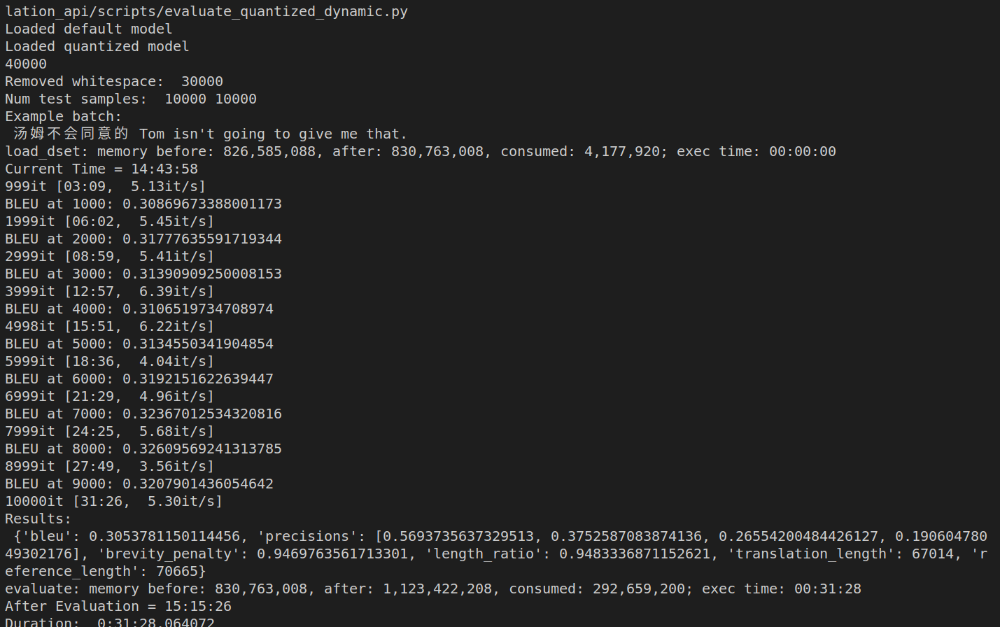

https://huggingface.co/Helsinki-NLP/opus-mt-zh-en

- Used same dataset as them
- but got absurdly high BLEU
  - Indicates data leakage, but I'm using the same test set as the pretrained model?

Actually, the reason is due to how I computed the metric.

BLEU was originally designed to be a corpus wide metric and I was computing it as such. However, this made it so that even if sentence translations are terrible, just by adding to the so called word bank dramatically boosts the value of the BLEU.

I originally used `add` in a loop like this:

```python
import datasets

metric = datasets.load_metric('my_metric')

for model_input, gold_references in evaluation_dataset:
    model_predictions = model(model_inputs)
    # maybe add_batch is different from add in affecting calculations?
    metric.add_batch(predictions=model_predictions, references=gold_references)

final_score = metric.compute()
```

I tried an approach similar to the one open where I compute the bleus for each batch of sentences (in my case, just 1) and average the result:

```python
        def process_data(args):
            bleu = load_metric("bleu")
            pred = self.predictor.predict(args[0]).split(" ")
            label = args[1]
            processed_labels = [label[0].split(" "), label[1].split(" ")]
            results = bleu.compute(predictions=[pred],
                                   references=[processed_labels])
            all_results.append(results)

        ...
              # calculate BLEU
        avg_bleu = 0
        for result in all_results:
            avg_bleu += result["bleu"]
        avg_bleu = avg_bleu / len(all_results)

```

However, I still ended up getting absurdly good results:

(100 samples)



- ~0.85 BLEU is absurdly good...I looked at the per sentence BLEUs and noticed that many of them had perfect BLEU scores of 1!
- This was a red flag that I had data leakage.

So, I decided to try a different test set from a different year.

That didn't work.

The fix was that the test set given also contained the machine translations from the model as the second reference. By only calculating BLEU with the first reference:



The average sentence BLEU was much more realistic (0.228).

- Note: This was done with 10k samples and 4 workers



The average sentence BLEU was only slightly less (0.221), but the model evaluation was almost 15 minutes faster! That's approximately a 32% increase speed for only a 3% decrease in performance.

- Note: This was done with the same parameters as the previous experiment.

## Corpus Level BLEU

The previous experiment used average sentence BLEU and they averaged around 0.22. However, this value was much lower than the official BLEU reported on the page (~0.35). The reason may be that the BLEU was calculated corpus level.

I then added support for that and ran the experiments with 6 workers for 10k samples:

The base model:



The quantized model:



Again, you can see that the quantized model only marginally worse (~3% worse) than the base model, but was much quicker (more than 25% faster).

Nevertheless, I was not able to reproduce the 0.35 BLEU for the base model (although it was much closer this time).
